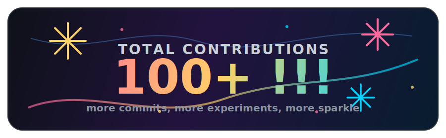

<!--
MIT License

Copyright (c) 2024 lelebixiong

Source repository: https://github.com/lelebixiong/lelebixiong
-->

  

  

  

## About Me

- Student majoring in Information Systems.
- Interested in AI agents, software engineering, coding tools, and medical technology.
- Currently learning how to turn notes, workflows, and experiments into reusable projects.
- I like clean structure, useful automation, and cute details that make technical work less boring.

## Highlight

  
  
  
  

  

## Project Contribution

  
  
  

  

## GitHub Dashboard

  

  
  

  

## Tech Stack

  

## Current Focus

| Area | What I am exploring |
| --- | --- |
| AI Agents | Comparing Codex, Copilot, Cursor, Claude Code, and Devin |
| Software Engineering | Requirements, testing, code review, and workflow design |
| Knowledge System | Obsidian notes, research radar, and reusable learning logs |
| GitHub Projects | Making repositories cleaner, more readable, and easier to revisit |

## Featured Notes

- [AI Agent Difference](https://github.com/lelebixiong/AI-agent-difference)
- [My GitHub Profile README](https://github.com/lelebixiong/lelebixiong)

## Connect

  
  
  

  

